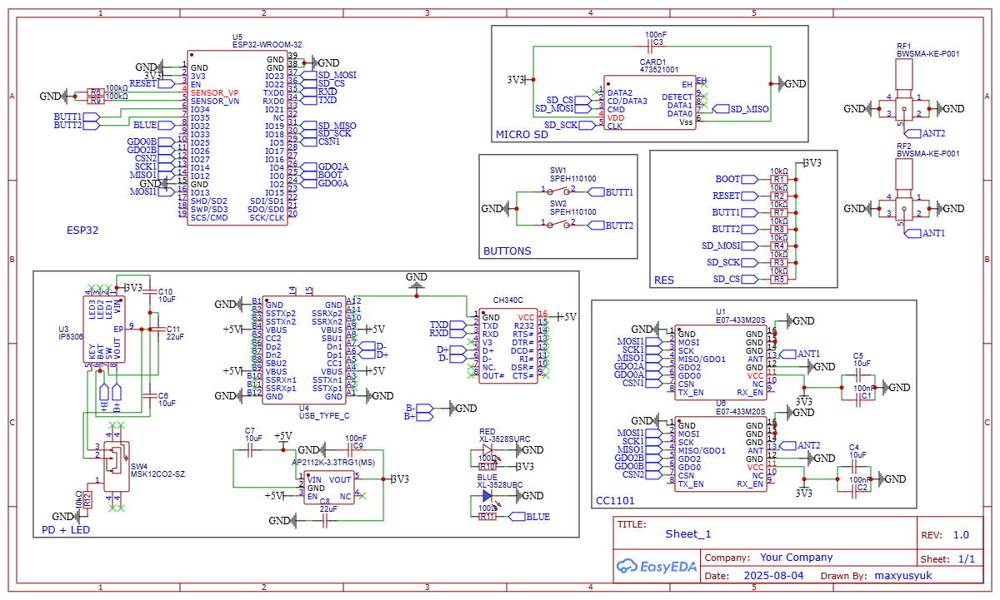
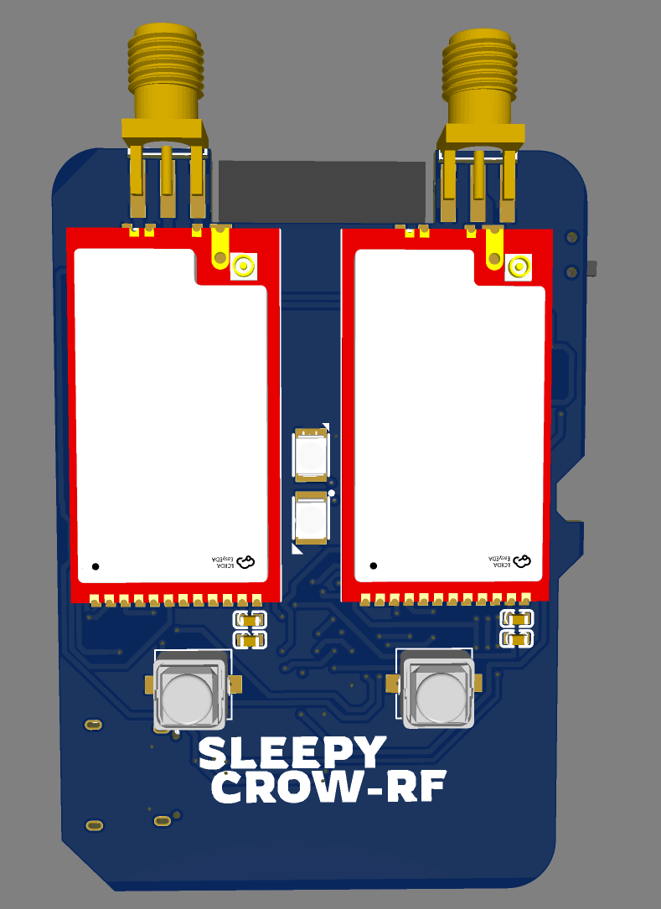
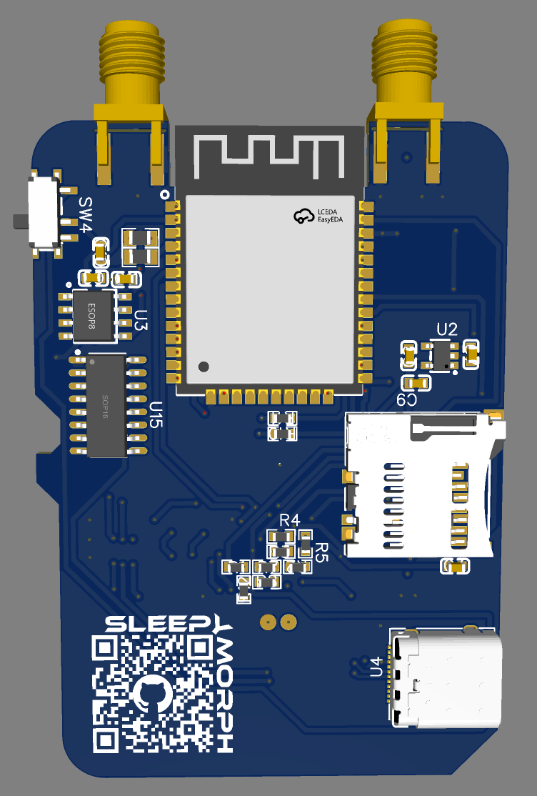
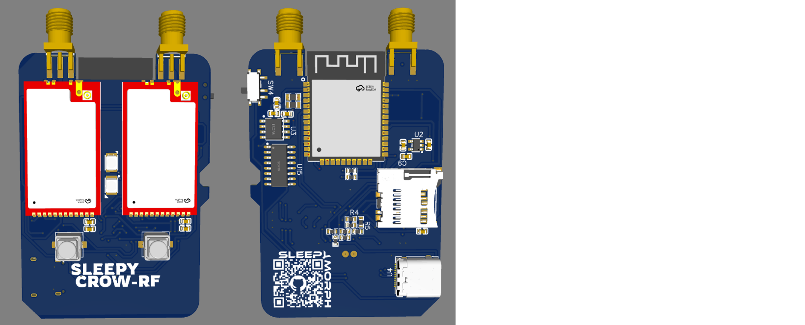

# 🦉 SleepyCrow RF

SleepyCrow RF is a **modded Evil Crow RF** device.  
This project improves upon the original design by adding new features, better stability, and optimized circuitry.  
It is ideal for hobbyists, researchers, and anyone interested in RF experimentation.

---

## ⚡ Schematics

### Main Schematic

The main schematic shows all components and connections.  
This is the foundation for building or modifying your SleepyCrow RF device.

---

## 📸 Device Images

### Front Side
  
The front side includes all main components, buttons, and indicators.

### Back Side
  
The back side shows the connectors, antenna ports, and secondary circuitry.

### Dual Side
  
The dual-side image demonstrates how both sides of the PCB are used, giving you the complete layout.

---

## 🔍 Features

- **Extended Protocol Support** – works with more RF signals than the original Evil Crow RF.  
- **Improved Signal Stability** – enhanced circuit design for reliable operation.  
- **Optimized Response** – faster processing and lower latency.  
- **Dual Board Design** – extra layers for advanced functionality and better layout.

---

## 🛠 Usage

1. Flash the firmware to your SleepyCrow RF device.  
2. Connect antennas and modules according to the schematic.  
3. Test all functions to ensure proper operation.  
4. Explore advanced features, like additional protocols or custom modifications.

---

## 📝 Notes

- SleepyCrow RF is based on Evil Crow RF but **not officially affiliated** with the original project.  
- Always handle RF devices carefully and follow local regulations for signal transmission.  
- This project is intended for educational and research purposes.

---

## 📜 License

Add your preferred license here (MIT, GPL, etc.).
